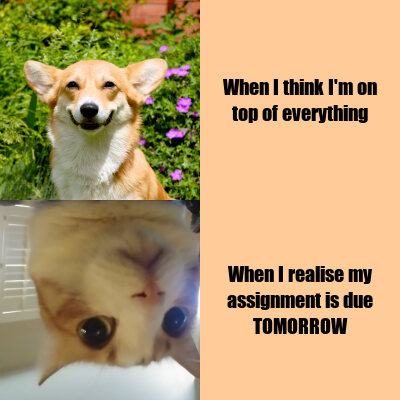

```r

library(magick)

#square one: corgi image
content_corgi <- image_read("https://i.imgur.com/OUng3AM.jpg") %>%
  image_scale(200) %>%
  image_crop("200x200+0") %>%
  image_border("#000000")

#square two: cat image
cat_with_regrets <- image_read("https://i.imgflip.com/3zrm9o.jpg") %>%
  image_flip() %>%
  image_scale("x200") %>%
  image_crop("200x200+0") %>%
  image_border("#000000")

#blank, colored square for the text
ginger_square <- image_blank(width = 200,
                             height = 200, 
                             color = "#ffcc99") %>%
  image_border("#000000")

#square three
corgi_text <- ginger_square%>%
    image_annotate(text = "When I think I'm on\ntop of everything",               
                 color = "#000000",
                 size = 20,
                 font = "Impact",
                 gravity = "center")

#square four
cat_text <- ginger_square %>%
  image_annotate(text = "When I realise my\nassignment is due\nTOMORROW",
                 color = "#000000",
                 size = 20,
                 font = "Impact",
                 gravity = "center")

#making each row of the meme
corgi_vector <- c(content_corgi, corgi_text) %>%
  image_append()

cat_vector <- c(cat_with_regrets, cat_text) %>%
  image_append()

#putting the final meme together
final_meme <- c(corgi_vector, cat_vector) %>%
  image_append(stack = TRUE)

image_write(final_meme, "my_meme.png")


```


